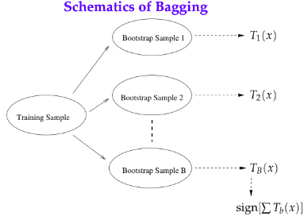
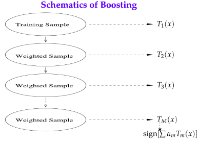
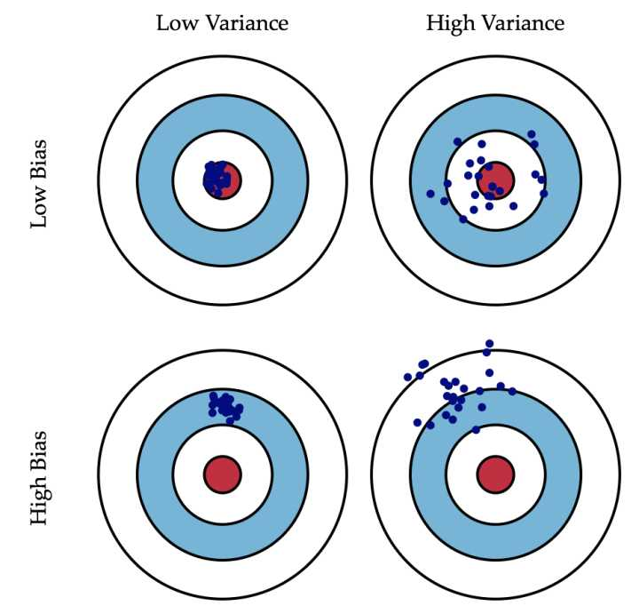

## bagging bootstrap

### 1. Defination

#### 1.1 Bagging

bagging是使用同一个网络架构,但是按照k个不同的训练数据集,训练出k个模型.最后预测的时候,根据k个模型的结果进行投票决定.

其中每个模型的训练集是全部训练集的子集.大致图如下:

#### 1.2 Boosting

这个模型是也是一个网络架构和k个训练集.但是通过迭代k次,训练出k个模型.最后预测的时候,根据k个模型的结果进行投票决定.

其中,每个模型的数据集不同的地方在于,每次迭代完之后,会有一个算法将本次迭代完的模型预测依然出错的数据的权重加大.即对每一轮的训练数据样本赋予一个权重，并且每一轮样本的权值分布依赖上一轮的分类结果.最后也是投票,即加权平均的方式来确定预测值.图如下:

### 2. Effect

#### 2.1 Bootstrap

Bootstrap是非参数统计中一种重要的估计统计量方差进而进行区间估计的统计方法，也称为自助法。

-   采用重抽样技术从原始样本中抽取一定数量（自己给定）的样本，此过程允许重复抽样。
-   根据抽出的样本计算给定的统计量T。
-   重复上述N次（一般大于1000），得到N个统计量T。
-   计算上述N个统计量T的样本方差，得到统计量的方差

上面的两个方法都可以说是bootstrap思想的一种应用.即不同模型采用的数据并不是全部的数据

#### 2.2 Bias and Variance

在5.4节也有讲,这个Bias和Variance,是不同训练集在同一结构训练出来的不同模型,在test data上的结果分布的性质.图如下:

#### 2.3 Bagging和Boosting对Bias和Variance的影响

-   **子模型之间的相关性的影响**

    -   类比正态分布:

        首先,我们可以看出bagging和boosting有一个共同的特征,那就是:

        认为单独一个模型具有一定的偶然性,或者独特性,通过增加模型,再求其平均,得到一个偶然性小的模型.训练集都是有误差的,根据不同训练之后模型相比于真实数据分布而言也是有误差的,比如说这个服从正态分布,那么随着采用数据(模型)的增加,其均值可以降低预测数据偏离于真实值的距离,也就是正态分布中的 $\mu$.

    -   独立同分布:

        那么,回顾正态分布,我们通常假设数据是独立同分布的.放在我们的问题中,就是我们希望模型是独立同分布的.下面来看看bagging和boosting.

        -   bagging:每个模型都是从整个数据集中采集的独立数据集.
        -   boosting:每个模型依赖于上一次迭代模型的结果.

        也就是说,bagging是符合独立同分布条件,而boosting是不符合的.

-   各自的效果:

    根据上述分析,我们可以得知bagging可以降低模型预测数据偏离于真实值的距离,也就是方差.

    boosting由于模型之间有强烈依赖,这就增加了模型的复杂度,也就是提升模型面对欠拟合的能力,也就实现了降低bias的功能.