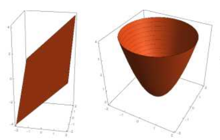
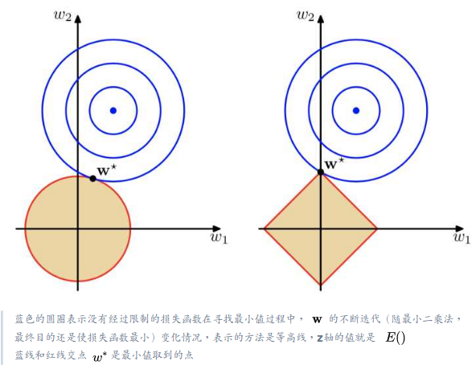

## 正则化

### 1. 正则化是什么?

-   正则化的英文是Regularization,也就是规则化的意思,就是给损失函数添加一条规则.即,加入先验知识.

    那么为什么要加入先验知识呢?因为,我们的模型在训练的时候经常会由于容量过高而产生过拟合的问题,我们需要对其进行约束,使模型容量降低.

-   下面来看加了正则项之后的函数:

    ​			$w^* = argmin_w L(y_i,f(x_i;w)) + \lambda \Omega(w)$

    即我们要从挑选出,能够使得损失函数和正则项的和最低的参数w.

    ----

    >   下面我们来开个小差,看看什么是损失函数:
    >
    >   损失函数有很多种,通常是随着具体的模型选择,例如,
    >
    >   -   线性回归:采用的是最小二乘做损失函数,就是用的Square Loss即平方误差:
    >
    >       ​	$ℓ(y_i,\hat{y_i})=(y_i−\hat{yi})^2$
    >
    >   -   在SVM模型中,要解决的是最大间隔问题,采用的是Hinge Loss
    >
    >       ​	$ℓ(y_i,\hat{y_i})=max(0,m−y_i+\hat{y_i})$
    >
    >       即我们希望正样本分数越高越好，负样本分数越低越好，但二者得分之差最多到m就足够了，差距增大并不会有任何奖励。
    >
    >   -   在Logistic Regression回归中,采用log-loss:
    >
    >       ​	
    >
    >       稍微解释下这个损失函数，或者说解释下对数似然损失函数： 
    >
    >       当y=1时，假定这个样本为正类。如果此时$h_θ(x)=1$,则单对这个样本而言的cost=0,表示这个样本的预测完全准确。那如果所有样本都预测准确，总的cost=0 .但是如果此时预测的概率$h_θ(x)=1$，那么cost→∞。直观解释的话，由于此时样本为一个正样本，但是预测的结果P(y=1|x;θ)=0, 也就是说预测 y=1的概率为0，那么此时就要对损失函数加一个很大的惩罚项。
    >
    >   -   等等,还有很多其他种类

    ----------

### 2. L0范数与L1范数范数

-   **L0范数与L1范数**

    L0范数是指向量中非0的元素的个数。如果我们用L0范数来规则化一个参数矩阵W的话，就是希望W的大部分元素都是0。换句话说，让参数W是稀疏的

    L1范数是指向量中各个元素绝对值之和，也有个美称叫“稀疏规则算子”(Lasso regularization).为什么L1范数会使权值稀疏？

    -   有人可能会这样给你回答“它是L0范数的最优凸近似”.
    -   还存在一个更美的回答：任何的规则化算子，如果他在Wi=0的地方不可微，并且可以分解为一个“求和”的形式，那么这个规则化算子就可以实现稀疏。这说是这么说，W的L1范数是绝对值，|w|在w=0处是不可微

    我们先看第一个答案，这个牵扯到凸优化理论，这里不做赘述，因为我也不会．这里说一下，为什么有必要用L1去代替L0?因为L0是一个NP难问题.反正就是认为

    

    ---

    >   NP难问题:
    >
    >   这里设计到了三个基本概念:
    >
    >   -   确定性算法(determinism):在算法的整个执行过程中，每一步都能得到一个确定的解，这样的算法就是确定性算法。
    >   -   非确定性算法(nondeterminism):它将问题分解成两部分，分别为猜测阶段和验证阶段，其中猜测阶段,在算法的每一次运行时,产生的值可能不同.在验证阶段回去验证猜测阶段产生的值是否正确
    >   -   多项式时间（Polynomial）：对于规模为n的输入，它们在最坏的情况下的运行时间为$O（n^k）$,其中k为某个常数，则该算法为多项式时间的算法.在计算复杂度的理论中，算法的计算时间也就是时间复杂度m(n)不大于算法规模n的多项式倍数，也就是说m(n)是关于n的一个多项式函数。例如，时间复杂度为$O(n^2)$的就是多项式时间，而时间复杂度为O（2^n）的则不是关于n的多项式函数，因此就不是多项式时间.
    >   -   规约/约化:简单的说，问题A可以约化为问题B，就可以理解为：问题B的解就一定是问题A的解。也可以理解为，“问题A可归约为问题B”，指问题B的答案可用于解决问题A。因此解决A不会难于解决B。
    >
    >   下面按照不同复杂度以及算法的类型,可分为下面四种类型:
    >
    >   P类问题，NP类问题，NP难问题，NPC问题
    >
    >   -   P类问题：在多项式时间内可解的问题。 
    >
    >   -   NP类问题（Nondeterminism Polynomial）：在多项式时间内“可验证”的问题。也就是说，不能判定这个问题到底有没有解，而是猜出一个解来在多项式时间内证明这个解是否正确。即该问题的猜测过程是不确定的，而对其某一个解的验证则能够在多项式时间内完成。
    >
    >   -   NPC类问题（Nondeterminism Polynomial complete）：存在这样一个NP问题，所有的NP问题都可以约化成它。换句话说，只要解决了这个问题，那么所有的NP问题都解决了。其定义要满足2个条件： 
    >
    >       -   首先，它得是一个NP问题.
    >       -   然后，所有的NP问题都可以约化到它。
    >
    >   -   NP难问题（NP-hard问题）：NP-Hard问题是这样一种问题，它满足NPC问题定义的第二条但不一定要满足第一条（就是说，NP-Hard问题要比NPC问题的范围广，NP-Hard问题没有限定属于NP),即所有的NP问题都能约化到它，但是他不一定是一个NP问题。NP-Hard问题同样难以找到多项式的算法.
    >
    >   -   这四个问题的关系如下:
    >
    >       

    ----

### 3. 为什么要实现稀疏?

-   **特征选择(Feature Selection)**

     一般来说，xi的大部分元素（也就是特征）都是和最终的输出yi没有关系或者不提供任何信息的，在最小化目标函数的时候考虑xi这些额外的特征，虽然可以获得更小的训练误差，但在预测新的样本时，这些没用的信息反而会被考虑，从而干扰了对正确yi的预测。稀疏规则化算子的引入就是为了完成特征自动选择的光荣使命，它会学习地去掉这些没有信息的特征，也就是把这些特征对应的权重置为0。

-   **可解释性(Interpretability)**

    模型更容易解释。

### 4. L2范数

-   它有两个美称，在回归里面，有人把有它的回归叫“岭回归”（Ridge Regression），有人也叫它“权值衰减weight decay”。他的左右和L0和L1不完全一样,他的左右是**防止过拟合**.

-   L2范数是指各参数的平方和然后求平方根。我们让L2范数的规则项$||W||_2$最小，可以使得W的每个元素都很小，都接近于0，但与L1范数不同，它不会让它等于0，而是接近于0，这里是有很大的区别的.

-   L2范数的优点之一:防止过拟合

    越小的参数说明模型越简单，越简单的模型则越不容易产生过拟合现象。

    为什么这样说呢?

    因为:越是复杂的模型，越是会尝试对所有的样本进行拟合，甚至包括一些异常样本点，这就很容易造成在较小的区间里预测值产生较大的波动，这种较大的波动也反映了在这个区间里的导数很大，而只有较大的参数值才能产生较大的导数。因此复杂的模型，其参数值比较大 。

    通过L2范数，我们可以实现了对模型容量的限制，从而在一定程度上避免了过拟合。

-   L2范数的优点之二:有助于处理 condition number不好的情况

    condition number不好,简单来说就是在对矩阵求逆的时候,如果一个输入矩阵的一个很小的误差就会导致输出的逆矩阵的值变化很大.那么,就可以说这个矩阵的condition number不好.

    这里和过拟合有点像,如果不考虑正则项的问题,怎很有可能多了一个训练数据,就会导致最后的结果相差甚远.

    下面会具体介绍condition number.

### 5.condition number

-   优化有两大难题，一是：局部最小值，二是：ill-condition病态问题。

    局部最小值问题就是防止算法进入局部解无法求得全局解的问题

-   ill-condition就对应了上面说道的:在对矩阵求逆的时候,如果一个输入矩阵的一个很小的误差就会导致输出的逆矩阵的值变化很大.这个时候的condition number就叫做ill-condition.

-   如何计算?

    如果方阵A是非奇异(满秩)的，那么A的conditionnumber定义为：

    ​				$\kappa(A)=|||A||||||A^{-1}|||$

    如果方阵A是奇异的，那么A的condition number就是正无穷大了。因为奇异矩阵就是非满秩矩阵的模为0.倒数为无穷大.

    实际上，每一个可逆方阵都存在一个condition number。但如果要计算它，我们需要先知道这个方阵的norm（范数）和Machine Epsilon（机器的精度）.

-   对condition number来个一句话总结：conditionnumber是一个矩阵（或者它所描述的线性系统）的稳定性或者敏感度的度量，如果一个矩阵的condition number在1附近，那么它就是well-conditioned的，如果远大于1，那么它就是ill-conditioned的，如果一个系统是ill-conditioned的，它的输出结果就不要太相信了。

-   condition number如何和Loss函数扯上关系呢?详情请见下一节.

### 6.参数w的解析解

我们的目标是使得LOSS函数尽量小,我们的最好最好的目标就是:

$Loss(y,\hat{y}) = 0$

其中,我们用下面这个公式试图去描述预测y

$y=wx$

这里的w是参数向量,x是特征向量,那么我们将所有的样本汇总成一个集合,就是

$Y=Xw$.

而我们的目标就是调整w,使得

$X\hat{w} =\hat{Y}$ 可以转化为

$\hat{w} =(X^TX)^{-1}X^T\hat{Y}$

注意注意!!!这里出现了求逆矩阵的过程,

然而，如果当我们的样本X的数目比每个样本的维度还要小的时候，矩阵$X^TX$将会不是满秩的，也就是$X^TX$会变得不可逆，所以w*就没办法直接计算出来了。或者更确切地说，将会有无穷多个解（因为我们方程组的个数小于未知数的个数）。也就是说，我们的数据不足以确定一个解.

但是,如果我们加上正则项,就会变成下面这个形状:

$\hat{w} =(X^TX+\lambda I)^{-1}X^T\hat{Y}$

这样,其中的$(X^TX+\lambda I)$就成了满秩矩阵,可以进行拟运算.

这里面，专业点的描述是：要得到这个解，我们通常并不直接求矩阵的逆，而是通过解线性方程组的方式（例如高斯消元法）来计算。考虑没有规则项的时候，也就是λ=0的情况，如果矩阵$X^TX$的 condition number 很大的话，解线性方程组就会在数值上相当不稳定，也就是说在改变细微样本的时候会导致结果差很多,会而这个规则项的引入则可以改善condition number。

最后的结论是:->L2范数不但可以防止过拟合，还可以让我们的优化求解变得稳定和快速。

### 7. L1和L2范数的区别

-   L1和L2都是规则化的方式，我们将权值参数以L1或者L2的方式放到代价函数里面去。然后模型就会尝试去最小化这些权值参数。而这个最小化就像一个下坡的过程，L1和L2的差别就在于这个“坡”不同.

-   现在我们先忽略LOSS函数项,先只考虑正则项的最小化.

    假定只考虑含有两个特征项也就是两个参数的函数:$y=\lambda \Omega(w)$

    那么L1和L2的图像就分别是下面的第一个和第二个:

    

-   接下来我们开始考虑损失函数,这里以最简单的损失函数,平方差为例子,假定,样本数据是以$(w_1,w_2)$为参数,在其附近随机生成的.那么,最后的拟合结果也应该是,参数的取值在离近$(w_1,w_2)$的地方,error低,离$(w_1,w_2)$远的地方error大.可以想像一个发散的圆,从圆心到四周扩散,值越来越大.就比如下面这个图中的蓝色等高线.

    

    关于这个图,现在只想象损失函数的登高线,这个登高线群构成了一个三维曲面,和红色图案的右边的那个有点像.

    现在想象,将登高线构成的三维曲面和正则化的的曲面或平面进行叠加.

    这时,可以感觉到,L2范数的LOSS函数是趋向与每个参数都小的.

    而L1范数的LOSS函数是让尽可能多的参数为0.可以想象在纯损失函数的同一层登高线上,即纯损失函数已经确定的情况下,让整体损失函数(即包含正则项的方法就是如上图右侧的图像)最小的方法.

    看下面这个图:

    

    现在我们关注三个点$w^1,w^2,w^3$

    在大正方形中,也就是正则项的值更大一点的情况下,大正方形会与最外圈登高线交于$w^3$,在$w^3$这里,可以看出,纯损失函数的值和$w^1$相同,正则项的值和$w^2$相同. 因此在大正方形的情况下,也就是正则项固定的情况下,最好的$w_1,w_2$的情况是在$w^2$处,也就是说定点处会使得总值最小,

    因此在纯损失函数项的值固定的情况下,使得正则项的值最小的方法就是**让正方形和现在所处的登高线只有一点相交**.

-   可以看到，L1范数 与L2范数 的不同就在于L1在和每个坐标轴相交的地方都有“角”出现，而目标函数的测地线除非位置摆得非常好，大部分时候都会在角的地方相交。注意到在角的位置就会产生稀疏性，例如图中的相交点就有w1=0，而更高维的时候（想象一下三维的L1-ball 是什么样的？）除了角点以外，还有很多边的轮廓也是既有很大的概率成为第一次相交的地方，又会产生稀疏性。

    相比之下，L2-ball 就没有这样的性质，因为没有角，所以第一次相交的地方出现在具有稀疏性的位置的概率就变得非常小了。这就从直观上来解释了为什么L1-regularization 能产生稀疏性，而L2-regularization 不行的原因了。

    因此，一句话总结就是：L1会趋向于产生少量的特征，而其他的特征都是0，而L2会选择更多的特征，这些特征都会接近于0。Lasso在特征选择时候非常有用，而Ridge就只是一种规则化而已。