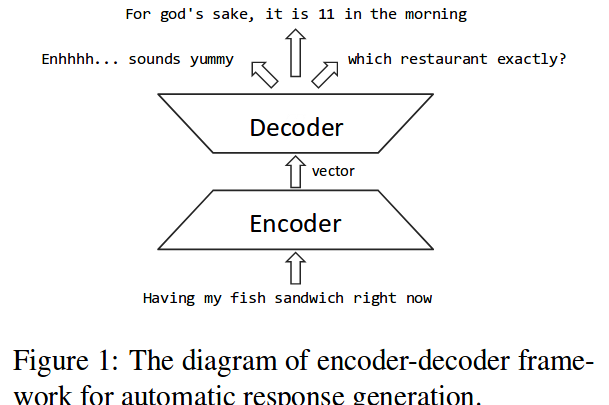
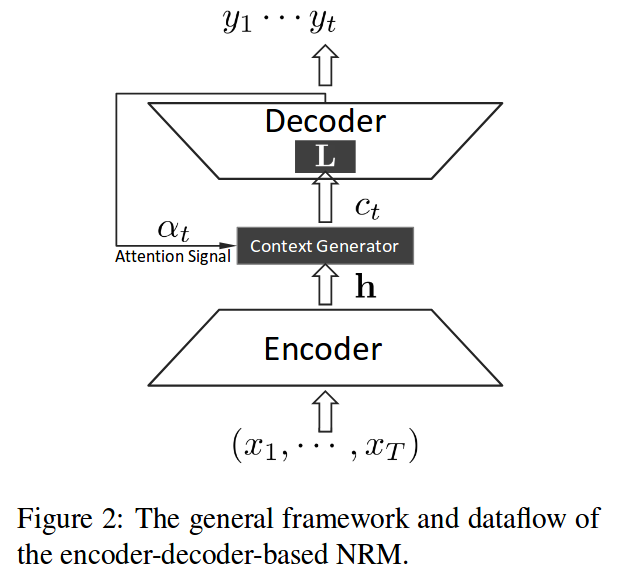
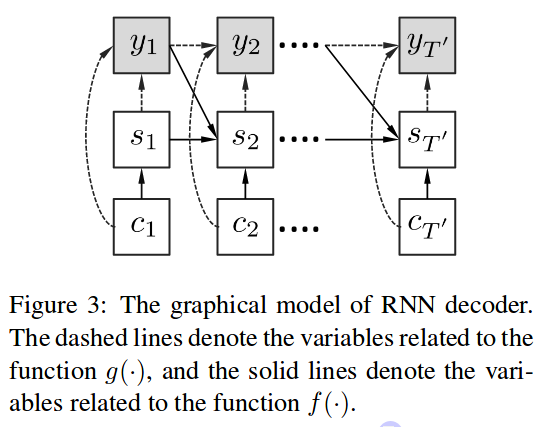
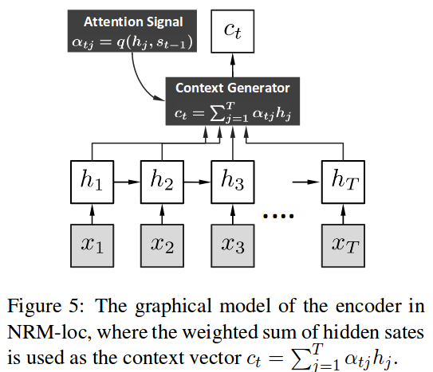
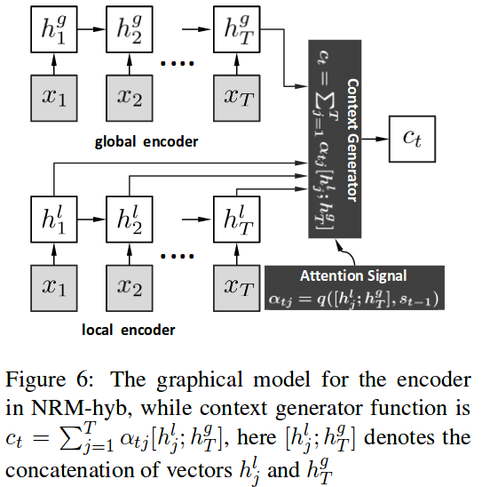
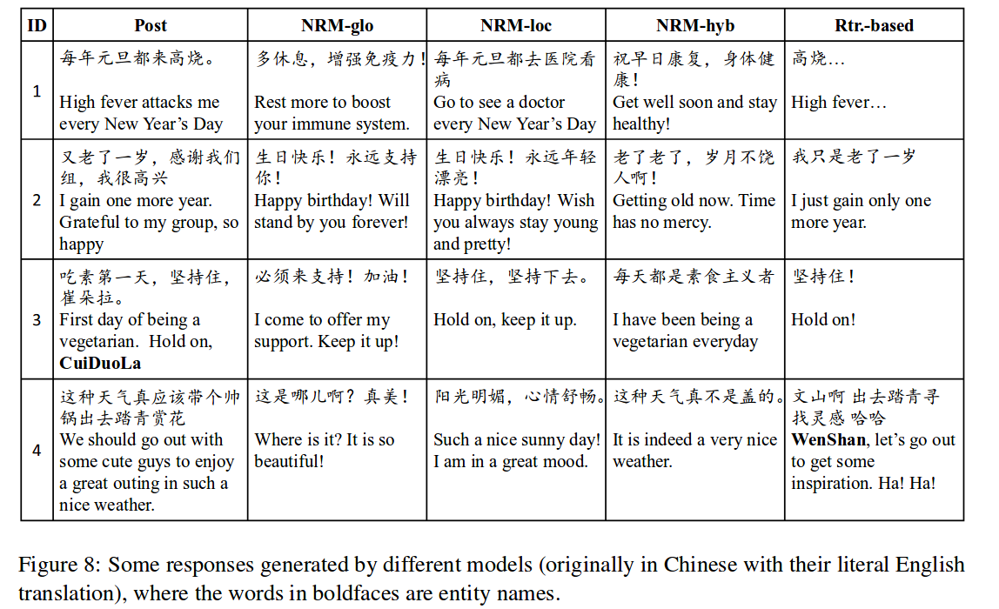

## Neural Responding Machine for Short-Text Conversation

### 1.Introduction

-   Natural language conversation is one of themost challenging artificial intelligence problems,which involves language understanding ,reasoning, and the utilization of common sense knowl-edge.

    这是一门包含了语言理解, 语言推理,已经常识的使用的科学

-   rule-based or learning-based methods 

    包含有基于规则以及基于学习算法的两种研究方法

-    **Short-Text Conversation (STC)**,短对话,是一个只拥有一轮对话的对话数据(one round of conversation).可从社交媒体上获取.

-   Previous methods for STC fall into two cat-egories, 1) the retrieval-based method (Ji et al.,2014), and 2) the **statistical machine translation(SMT) ** based method.

    现在的STC的研究可以分为两类,,一类是基于检索的,一类是基于统计机器翻译.

-   基于检索的方法是,通过给备选的答案排名,这些必选的答案是通过一些线性或者非线性的组合各种各样的匹配特征.

    下面是基于检索的算法的缺点:

    -   那些回答都是之前存在的,不能实现与时俱进
    -   无法实现正负情感的识别.

-   基于SMT的方法是,将post与response当做一个平行预料库,就是当做一个翻译语料库的感觉,用神经翻译系统进行训练

    下面是SMT的缺点:

    -   回答存在着严重的语法错误
    -   过于严格的对齐方式使其失去了对话的风格

#### 1.1. Overview

-   在本文中提出一个概率模型去解决生成问题

    并且使用了neural encoder-decoder(神经编码解码模型).被称为Neural Responding Machine(NRM).

- 下图是其基本结构

    

    ​

-   上面这个图的解释:

    - 先将post通过编码器编成一个向量再通过解码器解码为一个response
    - 然后该模型允许post(即输入)在生成的过程中动态变化.(这句话看了后面会懂)
    - NRM模型给出了一个the likelihood of aresponse given a post.就是说在给定post的情况下response出现的可能性的评价方法.即,可以计算 $P(response|post)$. 这个计算方法可以说是这个模型的核心,他的设计具有足够的复杂性可以表达所有情况下的 $P(response|post)$

- 本文贡献有两个:
  - 生成一个上面说的这个产出response的模型
  - 这个模型要比现存的基于检索的以及基于机器翻译的模型质量好

 

#### 1.2 Roadmap(路线图)

在第二章介绍路线图,第三章详细介绍模型,第四章介绍一些训练上的细节,五六张介绍实验结果和结论

### 2. he Dataset for STC

Our models are trained on a corpus of roughly 4.4 million pairs of conversations from Weibo.

就是使用了新浪微博中的投稿及其评论,大概每条投稿有20评论,该论文共使用了219,905条投稿,4,308,211个回复.构成了4,435,959对STC(短对话)

### 3. Neural Responding Machines for STC

-   $X:(x_1,...,x_T)$ 是输入的Input,也就是词序列,通过编码器转换成了一个**高维隐含向量h**(high-dimensional hidden representations).$h:(h_1,···,h_T)$

-   但是要注意这里的h并不是直接输入到解码器,注意,这里说的是解码器(decoder),而是到了context Generator里面,这个context generator的参数不仅有h还有一个 $\alpha _t$.这个 $\alpha _t$ 一个参数可以调整h,输出在t时刻的 $c_t$. 这个 $c_t$ 是这个词序列在t时刻产生的向量.这里的[时刻]是什么意思呢?见下文

-   上面提到的 $\alpha _t$ 叫做attention signal,它是用来决定h的哪一部分应该被强调.例如,在下面这个对话中:

    >   A:你和小明看过[银翼杀手2049]这部电影了嘛?
    >
    >   B:我自己看过了,他没有看.
    >
    >   C:没看过
    >
    >   D:[银翼杀手2049]不错
    >
    >   E:这个电影可以成为经典

    在这个STC里面,问句有几个不同注重点.

    1.  [你和小明],说明主语  				
    2.  [看过],而不是听过,听说过,吃过,买   
    3.  [银翼杀手2049]这个名词
    4.  [这部电影],这是一部电影,而不是一本小说
    5.  [了嘛?],说明是个问句

    分根据解读不同部分信息之后,可以做出通的回答.

    1.  -> 对应回答B 		2. -> 对应回答C 		3.-> 对应回答D  		4.-> 对应回答E

    该模型便是模拟这里,通过改变 $\alpha _t$ 来对不同位置的信息进行突出强调,生成不同的信息.

    因此,上一小结,最后的问题,[时刻是什么意思?],时刻1是指输入$x_1$的时候,时刻2是指输入$x_2$的时候,$x_n$就是指输入词序列中的第n个词.

-   $\alpha _t$ 是一个关于$(y_1,···,y_{t−1})$和输入序列的向量,的函数,就是已经生成的response的信息和post的信息作为决定$\alpha _t$的参数.

-   这里还有一个很重要的问题就是,输出的y的长度t是通过目标语句的长度来确定的.

-   上面说到了产生 $c_t$ ,这个 $c_t$ 是在t时刻由输入词序列生成的一个向量,到这里encoder即编码过程结束,下一步是解码过程(decoder),解码过程的第一步是先让 $c_t$ 乘以了 $L$ ,这个 $L$ 是一个矩阵,也就是说这里对 $c_t$ 进行了一个线性变换.这一步看起来很奇怪,但是非常非常重要,他是为了产生不同的候选结果,因为对话和翻译不同,翻译可以规定一个最佳答案进行配对训练,但是对话不一样,回答可以有很多,因此这里进行了线性变化.

    那么为什么是线性变换呢?这里,我自己的理解是,第一,这是最简单的方法,第二,对于一个句子的不同回答,可以看做,不同的回答者是在不同的语义空间去看待这个post.

-   进行线性变换后再通过decoder,输出最后的y.

模型大致如此,下面来细将decoder和encoder.

#### 3.1  The Computation in Decoder

-   你也许想问了,这里的decoder和encoder倒是什么呢?其实就是大名鼎鼎的循环型神经网络,这里你就理解为这是神经网络的一个变种就可以了,神经网络有一个缺点是,之前输入的信息对现在无法造成影响,这个在语言中是不可行的,因为句子的意思严重依赖其中的每个词,因此循环神经网络可以解决这个问题.这里拿decoder来图解一下这个循环神经网络

    

    首先这是一个三层的神经网络,c是输入层,s是隐含层,y是输出层,一般的神经网络只会考虑一次的输入和输出,而这里的循环神经网络,考虑了每次迭代之前的那些迭代过的神经网络,每进行一次新的神经网络的运算是,隐含层的信息不仅来源于输入,还来源于上一次的输出和上一次运算的隐含层的信息,这样在每次运算时都可以考虑到前面词汇所产生的所有信息,这样就将每个词汇的意思叠加在一起,即将这个句子的意思纳入计算,这也是我们的目的.

    不过这里的这个循环神经网络(RNN)还是有它的弱点,现在用的最广的RNN是LSTM网络,是这个网络的变种.

-   还记得我们上面说过我们要求的是一个 $p(response|post)$的概率模型,那么我们先看看得出第t个输出,即 $y_t$的概率公式是什么:

    ​					$p(yt|y_{t−1},···,y_1,x) =g(y_{t−1},s_t,c_t),$

    这里的 $y_t$是一个one-hot向量([介绍](http://www.52cs.org/?p=22)),这个向量里面的每个维度都是一个词.并且这里为了简化忽略了encoder过程,直接用c代替了x,g函数是一个softmax函数,是神经网络隐含层到输出层常用的一个函数,就是将其理解为一个分类函数就好了,输入一个值,输出一个类别.每个类别都代表着一个词.

-   然后其中的 $s_t$,即RNN的隐含层参数是怎么来的呢?

     					$s_t=f(y_{t−1},s_{t−1},c_t)$

    这里的f是一个non-linear activation function (非线性激活函数).并且在这里,上面提到的那个L,就是转化矩阵,通常也会作为f的参数.这里的f是一个逻辑函数(非线性激活函数的一种).

-   该模型使用的是RNN变种之一GRU(第一次听说,我也不熟悉).这个GRU和LSTM有一样的性能但需要更少的参数,并且对于序列格式的数据很友好.这个模型的其他的一些计算公式都在论文里面写着呢,我就不写到这了.

#### 3.2 The Computation in Encoder

和decoder不太一样,这里采用了三种encoder方案:

1) the global scheme, 2) the local scheme,and the hybrid scheme which combines 1) and 2).

##### 3.2.1 Global scheme

下面是大概图解:

可以看出来,在这个模型中没有 $\alpha$参数的影响,并且 $h_t=f(x_t,h_{t−1})$,选择最后一个词的h作为这个句子的向量.接下来直接让c等于h.并且是让每一个c都等于$h_T$,即$c_1=h_T,c_2=h_T,...,c_t=h_T$.

一个缺点是:a vectorial summarization(矢量和) of the entire post is often hard to obtain and may lose important details for response generation, especially when the dimension of the hidden state is not big enough.

##### 3.2.2 Local  Scheme

这里就关注了语句各个部分的信息.大致如下:

这里的权重因此 $\alpha _{tj}$决定了x中的哪一部分会被选择用来生成 $c_t$,进而生成第t个y,即 $y_t$.

其中,$α_{tj}=q(h_j,s_{t−1})$,这里$\alpha _{tj}$起到的是一种对其的作用.这个对齐机制一开始是被设计用来进行机器翻译中的对其的,利用:

>   源语言:     我喜欢看电影
>   目标语言:   私は映画を見るのが好き。

这里的语序的不对齐便可以通过这个模型进行调整.这里也是一个意思.

这里的给出了$α_{tj}=q(h_j,s_{t−1})$,那么这个q()又是什么,这篇论文中没有写,不过他提到了提出对齐机制的论文,恰巧我看过,这里的q又是一个神经网络.

意思是说,这里的context generator里面不仅仅只有$c_t=∑^T_{j=1}α_{tj}h_j$,还有一个神经网络用来训练q()函数.

##### 3.2.3 Extensions: Local and Global Model

我们再来回顾上面,Local版本中的这个$α_{tj}=q(h_j,s_{t−1})$函数,我们知道$\alpha _{tj}$是由一个神经网络确定的,这个神经网络的两个输入是$h_j,s_{t−1}$,输出为一个大于零小于1的实数(即权重$\alpha _{tj}$).那么,也就是说,当所有的训练结束之后,即神经网络里面的权重固定之后,权重的确定,完全由当前的输入词汇和上一次的输出词汇来决定,虽然说$h_j和s_{t−1}$都是含有之前的所有输出词汇,与输入词汇的信息的(因为是经过循环神经网络训练的).但是,这里忽略了当前输入词汇之后的词汇以及,以后的输出词汇对与该词汇的影响.

也就是说,作者认为,在分析:

>   你和小明看过[银翼杀手2049]这部电影了嘛?

这句话时,如果在确定第四个词汇:[看]的权重的时候,只考虑到了\[你\]\[和\]\[小明\]这三个词汇的含义,忽略了后面的内容的重要信息.并且因为短对话的内容具有非常不标准的对齐方式,因此一个词汇出现在不同上下文中时,其关于此词汇的回答也会大相径庭,因此,Local版本的这种忽略后面的内容的方式非常影响准确率,因此,需要在Local的基础上增加全局信息.

模型如下

在这里的权重$\alpha _{tj}$的计算中,用到了,Local与Global的结合体$[h^l_j;h^g_T]$,这里的[A:B]是指,将两者进行联级操作,即,

>    假设$A=(1,1,1,1),B=(2,2,2,2)$
>
>    则,$[A;B] = (1,1,1,1,2,2,2,2)$

##### 3.2.4 回顾

这一节确实有点复杂,以最后的这个混合模型为例,它里面有三个神经网络,encoder和decoder各一个RNN变种GRU,中间的那个context generator是一个前馈神经网络.你现在可以想想三个神经网络的输出输入分别是什么,想明白这个,那么这个模型你也就明白了.

下面这个是论文里面的一个例子,直观感受一下.

