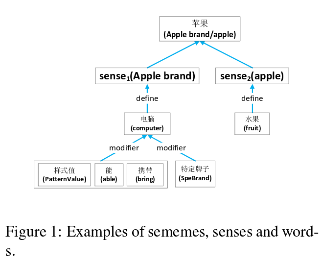
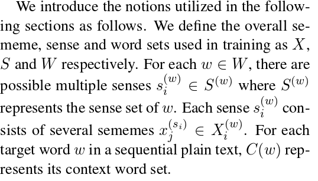
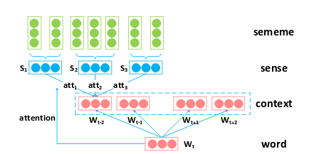

## Improved Word Representation Learning with Sememes

### 0. Abstract

首先介绍了什么是义原.义原就是词的意思的最小单位,这里使用了人工标注的词汇-义原词典 hownet.

这里的目的是

增强词向量.主要的方法是结合具体语料利用义原进行学习.利用语料的方法是skip-gram,结合义原学习了三种表征,义原表征,意义表征和词汇表征.并且使用了注意力机制.结果是,大大提高了在词汇相似度和词汇推理上的性能.

### 1. Introduction

利用hownet的语义信息改进词向量.在一个低维度学习词向量.

结合以往研究,包括2003年的神经语言模型,2012年的词义消歧的神经语言模型,以及2014年的利用synset(同义词集合,Wordnet?)改进的词向量.作者认为词汇的消岐对于词向量的设计至关重要,因此提出了这里的基于义原标注的词汇语义信息的词向量训练模型:Sememe Encoded Word Representation Learning model(SE-WRL)

这个框架认为一个词汇的词义是由不同的义原组合而成的.通过skip-gram模型学得的义原,词义和词汇向量来进行消岐.更有趣的是,**该模型通过注意力机制来根据上下文选择词汇的词义向量**.这里共提出了三种使用到了注意力机制训练SE-WRL的模型

通过在两个任务上的实现结果表明,结合义原信息的知识表征系统具有更强的表达真实知识结构的功能.

### 2. Related work

#### 2.1 Word Representation

可以说词向量的训练到2015年为止一直是热点,大体分为三次性质上的变革

-   单词单向量不加入外部知识

    从一开始简单的基于n-gram上改进的的神经语言模型.再到2013年出现质的飞跃的skip-gram模型训练出的word2vec向量(基于条件概率),这个模型在有效性和效率上实现了一个平衡.

    还有在此之上进一步改进的glove词向量(一个基于互信息而不是条件概率的计算模型).但是到目前为

-   单词多向量不加入外部信息

    这个代表作就是huang2012年的基于kmeans分类的词向量表示.还有Neelakantan于2015年结合skip-gram提出的,non-parametric multiple embeddings per word 模型,我的理解是自动确定分类数,不是像k-means提前设定分类数目的parametric.

-   加入外部信息

    Rothe and Schutze, 2015,应该是使用到了类似于wordnet之类的知识图谱来增强词向量.

经过这三次之后,词向量的训练便鲜有杰作.这个论文可以说是一个,单词多向量且加入义原标注词库信息的词向量训练模型,属于第三类.

#### 2.2 Word Sense Disambiguation and Representation Learning

Word sense disambiguation (WSD) 词义消岐主要有两种方法,这里不局限于必须要使用词向量可以是只基于符号统计的方法:

-   **supervised methods**:

    Lee et al., 2004提出的一个基于上下文词汇及其特征作为特征来进行SVM分类的模型.因此需要大量的人工标注的训练数据.

-   **knowledge-based methods:**

    利用外部的大型知识库比如词典或者wordnet(主要是标注了词汇之间的层级关系)去分类.想最近一两年就有了很多利用wordnet去训练词向量的方法.此外还有一个比较特殊的是:使用personalized PageRank 去学习de-conflated semantic representation的基于本体的方法(没看过,不知道是啥)

### 3. Methodology

下面介绍Sememe-Encoded WRL (SE-WRL)模型(加入义原信息来进行词义消岐).下面分三步介绍:

-   Sememes, Senses and Words in HowNet
-   Conventional Skip-gram Model
-   SE-WRL Model

#### 3.1 Sememes, Senses and Words in HowNet 

这里的Sememes, Senses and Words其实是层级关系,一个word会有几个senses,也就是几个词义,每个词义又可以分解为最基本的义原.如下图:

下面是Sememes, Senses and Words的符号表示,全是公式符号就直接截图了.

#### 3.2 Conventional Skip-gram Model

这里使用了skip-gram model.词汇词向量的词向量由其下的义原向量构成.

如题目所示,这个模型采用了卷积窗,其实就是共现窗.卷积网络在文本中的应用详见[利用CNN进行文本分类]的论文笔记.

既然是一个监督性学习算法,那么肯定要有loss函数,这里还是采用的负对数似然作为损失函数.这个也是原先skip-gram的核心公式.如下:

这里的 $K$ 就是卷积窗口的大小.

那么这个公式就是求在已知某个词汇之后,其周围词汇为 $w_{i-k},...,w_{i+k}$ 的概率.其中:

这里的 $C(w)​$ 是以 $w​$ 为中心的大小为K的卷积窗口.(为什么不是2K+1?? $w_{i-k} \to w_{i+k}​$ 的数目不应该是 $2K+1​$ 吗?).

**要注意的是:这里为了简单起见用了最一般的softmax,但是实际的skip-gram的精华在于其设计了h-softmax(hierarchical softmax).除此之外,还有一个negative sampling技术.**

反正,按照这个模型,就可以训练出词向量了.

### 3.3  SE-WRL Model

三个策略:

-   Simple Sememe Aggregation Model (SSA):简单义原聚合模型
-   Sememe Attention over Context Model (SAC):义原的注意力上下文模型
-   Sememe Attention over Target Model (SAT):义原的注意力目标模型

#### 3.3.1  Simple Sememe Aggregation Model

这个模型就是简单地,把一个word的词向量设置为其下面所有senses的所有sememe向量的平均值.如下:

因此这个模型与其说训练所有词汇的词向量,不如说是训练所有义原的词向量(ちなみに、这个hownet中共有2000左右个义原,所有需要计算的值不多).

然后剩下的就交给上面的卷积skip-gram model去训练就好了.

基于这个简单的模型,可以想象,那些拥有相近义原的词汇会有更近的值.但是,这个模型没有针对不同的上下文去选择其相对应的sense,也就是说没有消岐,下面的这个模型就会去基于上下文来分配注意力.

#### 3.3.2 Sememe Attention over Context Model

这个模型简而言之,就是给把上面的平均值换成了加权和.

下面是符号说明:

|  $w_c$   |    $s^{(wc)}_j$    |            $attr(s^{(wc)}_j)$            |     $x^{(s_j)}_k$      |
| :------: | :----------------: | :--------------------------------------: | :--------------------: |
| 词汇的综合词向量 | $w_c$的第i个sense的词向量 | 根据注意力机制计算的在特定上下文中,词汇$w_c$的词义是$s^{(wc)}_j$的概率 | 组成$s^{(wc)}_j$的第j个义原向量 |

这个模型,对于卷积窗中的每个词汇的词向量分析都进行了其sense的加权和,模型图如下:

共现词汇(context word)词向量的计算是根据其下义原均值,计算公式就是3.3.1中的那个公式.

目标词汇(target word)词向量的计算是其下义原的加权和,权重由共现词汇与义原决定

公式如下:

其中,$attr(s^{(wc)}_j)$ 就是权重,其定义是由sofmax来的,这里的 $w$ 是目标词汇的词向量(也就是3.3.1中的简单均值):

而$s^{(wc)}_j$ 的计算公式是其所属义原的平均值.

这个机制比较好懂,就是一个基于softmax的注意力模型(其实就是加了个权重而已).

**这里和huang2012年的消岐的不同在于,这里采用的是一个分布形式,而不是0-1形式,每个sense都有一定的影响到词汇在此上下文中的词向量,而不只是一个.因此在不同的上下文中,同一词汇的词向量也是不尽相同的,这个叫做 soft WSD.**

#### 3.3.3 Sememe Attention over Target Model

与上面的SAC不同,这里的target和context的词向量处理方式进行了颠倒:

-   **SAC是:**

    共现词汇(context word)词向量的计算是根据其下义原均值.

    目标词汇(target word)词向量的计算是其下义原的加权和,权重由共现词汇与义原决定

    也就是:

    $target(word\_embedding) = $

    $context(word_embedding)=$ 

-   **SAT是:**

    共现词汇(context word)词向量的计算是根据其下义原均值.

    目标词汇(target word)词向量的计算是其下义原的加权和,权重由共现词汇与义原决定

    也就是:

    $target(word\_embedding) = $

    $context(word_embedding)=$ 

具体如下:

其中如上面所说,其目标词汇的向量公式是:

其中 $att(s^{(w_c)}_j)$ 是计算的目标词汇下义原和共现词汇的表征 $w_c'$ 共同出现的概率,公式为:

其中 $w_c'$ 的计算公式是, $2K$ 个共现词向量的均值.也就是:

### 4  Experiments

实验结果是,SAT一般都具有最优效果.