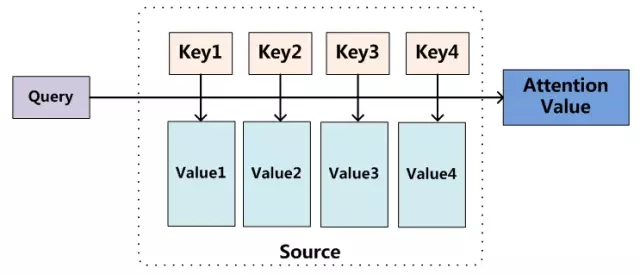
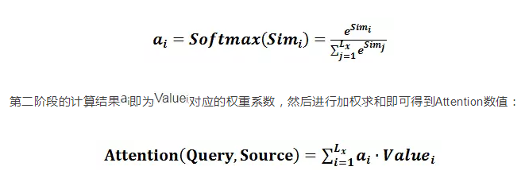
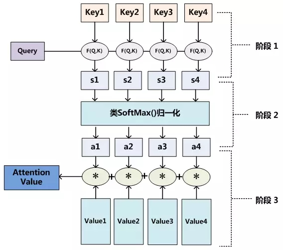
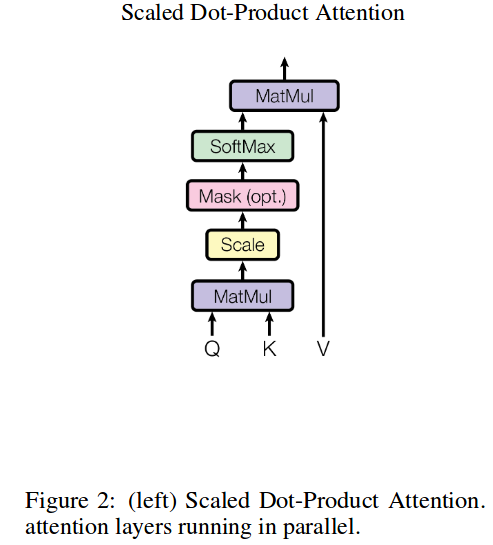
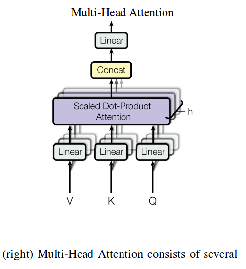

## All You Need Is Attention

### 1. Introduction

循环模型把输入序列和输出序列的位置信息纳入计算需要考虑的因素,并且在计算过程中计算步骤和序列位置有对齐关系.这种固有的顺序性妨碍了数据集的并行训练.并且在序列过长的时候,由于内存限制,限制了实例间的批处理.最近在因式分解以及有条件的计算上,已经实现了重大的进步.

注意力机制已经成为传导模型和序列模型的组成部分.这使得允许在输入或输出序列中不依赖其距离的依赖关系建模.但是在最近的研究中,这个机制还是和循环网络在一起使用.

在这个研究中,避开使用循环机制而只使用注意力机制,构建了一个输入和输出之间的全局依赖关系.称这个模型为Transformer,可以实现更快速的并行运算,并且实现了最佳翻译质量.

### 2. Background

降低序列计算的目标形成了扩展神经GPU的基础,基本上都是用卷及神经网络作为基石进行构建.并行地计算输入和输出的隐含层表示.随着输入和输出两个位置距离的增长,计算量也变大,有的是线性增长,有的是log增长.这使得学习两个相距较远的距离的输入和输出的关系变得困难.但是在transformer中,这个值是一个常量.尽管在这个过程中产生了分辨率降低的副作用.

内注意(self-attention)是一种注意机制，它联系起来了单个序列的不同位置，以便计算一个序列的表示。

**End-to-end memory networks(2015的一个网络模型)** 是基于循环注意力机制而不是序列对齐的循环机制.

Transformer是第一个完全依赖内注意机制而没有用到卷及网络和循环网络去计算输入和输出的表示的机制.下面就要介绍Transformer,以及激励型内注意机制.

### 3. Model Architecture

大部分的**竞争型神经(竞争型神经网络需要看看)**序列传导模型都有一个encoder-decoder结构.在这个模型中的每一步都是自回归的(auto-regression),即将当前的生成的符号作为预测下一个输出的输入.

----

>   自回归模型是指:变数的值$x_t$是依据$x_{t-1},x_{t-2},...,x_1$来预测的,而不是根据其他变量,也就是说t时刻x的值和过去x的值有关,并且假设为线性关系,只是不用 x預測 y，而是用 x預測 x（自己）；所以叫做自迴歸.

----

Transformer用stacked self-attention和 point-wise(逐点式)是实现这整个架构,encoder和decoder直接实现全链接.

整个结构图如下:

下面来详细介绍:

#### 3.1 Encoder and Decoder Stacks

-   **Encoder**:

    这个是由六个相同的层组成的栈构成的,其中每个层次里面又有两个子层.第一个就是**Multi-head attention**.第二个是简单的逐点全连接的**Feed Forward**网络然后,这两个子层之间的i连接方式,就是那个 **Add&Norm**是使用的**layer normalization**的方法(这是一个加速深度网络训练的方法).也就是说,每一个子层的输出都等于$LayerNorm(x+ Sublayer(x))$.$Sublayer(x)$是指这个子层对输入进行操作后的值.这里的输入输出向量的维度是512.

-   **Decoder**:

    decoder更牛,他也是由六个相同的层组成的栈构成的,其中每个层次里面又有三个子层.这个decoder中蕴含着这篇论文的精华,即,取消long dependency,而是句子中的单词dependency长度最多只有1,减少了信息传输路径。在这里的**Masked Muti-Head Attention**是对Muti-Head进行修改的结果,他避免了当前位置的此向量参与到后来的分析中.

#### 3.2 Attention

Attention(注意力机制)就是说,给定一个函数可以将一个查询和一个键值对映射到一个输出.其中,查询,键,值,输出都是向量.输出是值的一个加权和,其中每个值权重的计算是根据,查询的向量以及与其对应的向量为变量的兼容性函数.

>   注意:这里的键值对.键和值都是词向量.是一样的,这里的关于Attention的描述是一个抽象的形式.在机器翻译的任务中,key和value都是词向量.
>
>   其次,这里的query应该是上一个输出词汇的词向量.

----

>   这里稍微展开一下注意力机制
>
>   下面这张图是Attention机制的本质思想:
>
>   
>
>   -   1.  即对于一个要查询的量(query),我们认为他是由一系列的输入决定的(就是keys,values),其中每个(keys,values)对于query值的确定贡献是不同的,因此需要赋予每个key一个权重,使得最后的Attention是一个Values的加权和.
>       2.  这里的key和value其实指向同一实体,key通常是一个抽象的概念.他的ID是key,值是value,因此在机器翻译模型中,key和value都是一样的,即,都为输入词向量(或是输入词向量在隐含层的表示).
>       3.  通过query和key计算权重的方法有很多:
>
>   
>
>   -   这样一来,Attention机制便可以抽象为一个公式:
>
>   
>
>   -   由于经过query和key之间的相似度计算出来的值并不是归一化的值,因此还要经过归一化,一般采用sofmax函数:
>
>   
>
>   -   最后的详细的计算过程图如下:
>
>       
>
>   -   self-attention
>
>       self-attention和一般的attention的区别是在不同应用中体现出来的,一般的attention,比如之前看过的2014年的那篇论文,attention中的query是目标词汇,输入是源词汇,这是两个不一样的语言,但是在self-attention中,query和(key,value)是一个值,看下面这个例子:
>
>       
>
>       在这个例子中,我们可以看到,通过self-attention机制,我们找到了这个句子中与每个词汇具有最强语法关系的词汇,也就是说:
>
>       -   一般的attention:起得是对齐的作用(将原语言和目标语言的词汇对应起来)
>       -   self-attention:起得是语义挖掘的作用.

----

##### 3.2.1  Scaled Dot-Product Attention

图如下:

-   这里的Q,K,V分别是query,key,value.结合上面的self-attention的定义.

    -   这里的query的意义应该是,[与目前这个词汇最有语义关系的词汇是什么?],因此,在这里query应该是当前词汇的向量.
    -   key代表的是,[句子中的这个词与query词汇的语义关系],应该是这个词汇的向量.
    -   value代表的是这个词汇的词向量,和query是一样的.
    -   其次,论文中说,The input consists of queries and keys of dimension $d_k$, and values of dimension .这里的$d_k$和$d_v$其实是一样的.只是在抽象意义中,两者的维度没有关系而已.

-   结构的解释:

    -   这里的MatMul是计算Q和K关系的一种方法,这里设定的是点乘.

    -   scale是对点乘后的结构进行一个缩小,即,除以$\sqrt{d_k}$,这里除以$\sqrt{d_k}$的原因是:

        常用的attention机制有additive attention,简写成AA（由一个前向神经网络实现）和dot-product（multiplicative） attention，简写成DA。虽然两种方法理论上的复杂度类似，但DA实际运行速度更快且更节省内存.当dk值比较小时，两种算法效果相当，但当dk值比较大时，AA比DA要好，作者怀疑原因可能是,当$\sqrt{d_k}$的值过大时,点积的体量就会增加使得之后的softmax函数只有极小的导数.为了抵消这个效果,除以了这玩意.

    -   mask,是一个掩码操作,我个人认为这里可能是对可能性进行了一个过滤,即除去了一些概率极低实际是没有关系的词汇的影响.并且对距离做了一些限制,限制了太远的词汇加入考虑.

    -   softmax:进行归一化操作,最终出来权重.

    -   最后的MatMul:加权和,得到最后的注意力值.

    -   最后的公式如下:

        

    -   ​

##### 3.2.2  Multi-Head Attention

图如下:

-   这个图很有意思,他相当于先并行的计算h个Scaled Dot-Product Attention,再将最后的结果级联起来,这里有个问题,在之前的Scaled Dot-Product Attention中,设定$d_k$是512,那么最后出来的结果也应该是512,这里的级联岂不是成了512*h维?

    其实,不是的,这里在最初对$d_k,d_v$进行了限制,限制方法,一会说,现在先看这个模型的细节.

-   之前说过要计算h次,那肯定不能每次都一样啊,因此这里的法子就是,在每次里面对Q,K,V进行线性变换,将Q,K,V的值投射到不同空间,当然了,这个线性转换的参数是要经过训练.

    怎么样!!!!有没有想到卷积网络,感觉这就是卷积网络的一个变形啊.这样的话,可以认为每次线性变换都提取了语义的不同信息.

-   现在来说说,如何对$d_k,d_v$进行限制.这里是通过压缩$d_k,d_v$的值来实现的.这里规定:

    $W^Q_i∈\mathbb{R}^{d_{model}×d_k},W^K_i∈\mathbb{R}^{d_{model}×d_k},W^V_i∈\mathbb{R}^{d_{model}×d_v}$

    并且,$W^O∈\mathbb{R}^{hd_v×d_{model}}$

    Conact是级联的意思.

    $h=8,d_k=d_v=d_{model/h}= 64$

    这样就实现了最后出来的结果也还是512.

    ​

##### 3.2.3  Applications of Attention in our Model

Transformer在三个地方用到了muti-head attention :

-   In "encoder-decoder attention" layers, the queries come from the previous decoder layer,and the memory keys and values come from the output of the encoder. 这个不是self-attention,而是一般的attention,在之前的模型中经常用到,只是该模型没有用CNN或者RNN,而是只用attention构建的网络结构.这个是该翻译模型的真正驱动器.

-   encoder包含了一个内注意层,在这个层中,所有的keys,values,queries都来源上一个层,这个怎么理解呢?我的理解是,首先,输入句子中的每个词在经过一个encoder的层时,都会产生一个向量,这个向量是综合了整个句子的信息的,就是上面说道的muti-head attention的作用,这样的话,输入的每一个词就对应了一个处理后的新词.即:

    $Q^1 \rightarrow Q^2,K^1 \rightarrow K^2,V^1 \rightarrow V^2$

    由于在encoder的内注意力机制中,Q,K,V都是从一个句子中出来的,所以经过一层的训练,三个值都可以更新.

    那么,$Q^2$和$Q^1$相比,词汇和词汇之间建立起了更多联系,接着

    $Q^2 \rightarrow Q^3,K^2 \rightarrow K^3,V^2 \rightarrow V^3$

    ...

    $Q^5 \rightarrow Q^6,K^5 \rightarrow K^6,V^5 \rightarrow V^6$

    就得到了最后的一个句子.在每一层处理完之后,该层的每一个位置都含有上一层中所有位置的信息.

-   相似的,decoder中的self-attention层也是一样。不同的是在scaled点乘attention操作中加了一个mask的操作(设置为负无穷)，这个操作是保证softmax操作之后不会将非法的values连到attention中,比如你这一位置query attention的values不能有这一位置之后的values的信息，只能有该位置前面的values.(以上摘抄自他人博客,下面是自己的理解)

    首先,decoder和encoder不一样的地方是:

    -   decoder要接受两个输入,一个是encoder的信息,一个是之前的output的信息,从下面这个结构图中便可见一斑.

        

        在这个图里面,我们可以看到,中间的那一层Muti-head attention有两个输入,一个来自与encoder一个来自之前的output,并且,output的值是经过Masked Muti-head Attention处理的,这个应该就是上面说的,为了防止加入不合法的value,因为后面的很多位置还是空的.这个Mask就是通过scaled dot-product attention中的那个Mask层实现的.

    -   还一个要注意的是,decoder中的两个Muti-head有着完全不同的性质,一个是seq2seq的attention机制,一个是内注意力机制.

#### 3.3  Position-wise Feed-Forward Networks

逐位置的前馈网络

$FFN(x)=max(0,xW1+b1)W2+b2$

该网络是两个线性变换，中间加了一个ReLU激活函数。每个位置（position）上的线性变换是一样的，但是不同层与层的参数是不一样的。该网络的输入和输出维度都是$d_{model}=512$ ，不过中间层的维度是2048.也就是说,隐含层中的node数是输入输出的四倍.

#### 3.4  Embeddings and Softmax

这一小节,就是交代了这里面的词向量是训练好的,并且里面的各种参数是要经过训练的,包括线性变换的参数以及softmax的参数.

#### 3.5  Positional Encoding

这里是指将词汇的位置信息也加入考虑，采取的方法是利用下面的这个公式计算词汇的位置信息：

由于模型没有任何循环或者卷积，为了使用序列的顺序信息，需要将tokens的相对以及绝对位置信息注入到模型中去。论文在输入embeddings的基础上加了一个“位置编码”。位置编码和embeddings由同样的维度都是$d_{model}$ 所以两者可以直接相加。有很多位置编码的选择，既有学习到的也有固定不变的。本文中用了正弦和余弦函数进行编码。这样做的目的是因为正弦和余弦函数具有周期性,对于固定长度偏差k（类似于周期）,post +k位置的PE可以表示成关于pos位置PE的一个线性变化(存在线性关系),这样可以方便模型学习词与词之间的一个相对位置关系.

加入的方法是,将位置信息和源词向量相加.

